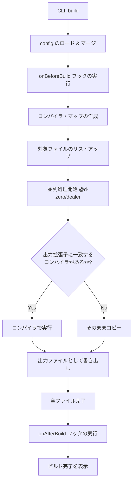
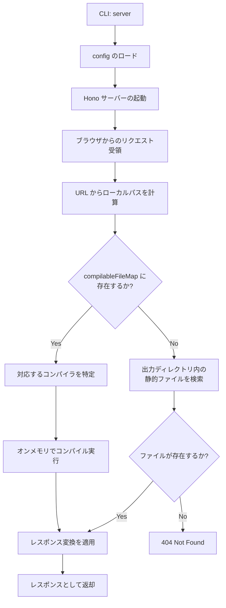

# 🏗️ Kamado 内部アーキテクチャ

Kamado は、「オンデマンドで HTML を焼き上げる」静的サイトジェネレーターです。
このドキュメントでは、Kamado の内部構造、CLI からビルド/サーバー実行までのフロー、およびプラグインシステムについて、主にコントリビューター向けに解説します。

## 核心となるコンセプト

1.  **オンデマンド・コンパイル (Dev Server)**:
    開発サーバーは、リクエストがあった瞬間に必要なファイルだけをコンパイルして返します。これにより、大規模なプロジェクトでも起動が高速です。
2.  **プラグイン・ベースのコンパイラ**:
    HTML、CSS、JavaScript などの各ファイル形式は、それぞれ独立した「コンパイラ」によって処理されます。
3.  **No Runtime**:
    生成される成果物に Kamado 独自のクライアントサイド・ランタイムは含まれません。
4.  **Config vs Context**:
    Kamado はユーザー設定（`Config`）と実行時コンテキスト（`Context`）を分離しています。`Context`型は`Config`を拡張し、CLIコマンドによって実行時に設定される`mode`フィールド（`'build' | 'serve'`）を追加します。これにより、コンパイラやフックがビルドモードか開発サーバーモードかを検出できます。

---

## Config vs Context

### Config

`Config`は`kamado.config.ts`から提供されるユーザー設定を表します。以下を含みます：

- ディレクトリ設定（`dir.input`、`dir.output`）
- 開発サーバー設定（`devServer.host`、`devServer.port`）
- Package.json情報（`pkg.production.baseURL`など）
- コンパイラプラグイン
- ライフサイクルフック

### Context

`Context`は`Config`を拡張し、実行時情報を追加します：

```typescript
export interface Context extends Config {
	readonly mode: 'serve' | 'build';
}
```

`mode`フィールドは**ユーザーが設定できません**。CLIコマンドによって自動的に設定されます：

- `kamado build` → `mode: 'build'`
- `kamado server` → `mode: 'serve'`

### モードの伝播

実行モードは以下のようにシステム全体に伝播します：

1. **CLI**（`src/index.ts`）：ユーザーが`kamado build`または`kamado server`を実行
2. **Builder/Server**（`src/builder/index.ts`または`src/server/app.ts`）：`Config`をスプレッドして`mode`を追加し、`Context`を作成
3. **コンパイラ**：`Config`ではなく`Context`を受け取り、実行モードを検出可能
4. **フック**：ライフサイクルフック（`onBeforeBuild`、`onAfterBuild`）とコンパイラフック（`beforeSerialize`、`afterSerialize`、`replace`）が実行モードを受け取る

このアーキテクチャにより、以下のようなモード固有の動作が可能になります：

- 開発サーバーモードでは開発サーバーURLを使用、ビルドモードでは本番URLを使用
- フックでの異なるDOM操作動作
- 実行コンテキストに基づく条件付き処理

---

## ディレクトリ構造

`packages/kamado/src` 配下の主要なディレクトリとその役割です。

- **`index.ts`**: CLI のエントリポイント。`@d-zero/roar` を使用してコマンドを処理します。
- **`builder/`**: 静的ビルド（`kamado build`）の実行ロジック。
- **`server/`**: 開発サーバー（`kamado server`）のロジック。Hono を使用。
- **`compiler/`**: コンパイラ・プラグインのインターフェースと、機能マップの管理。
- **`config/`**: 設定ファイルのロードとマージ、デフォルト値の定義。
- **`data/`**: コンパイル対象ファイルのリストアップ、アセットグループの管理。
- **`files/`**: ファイル読み込み、Frontmatter 処理、キャッシュ管理などのファイル抽象レイヤー。
- **`path/`**: パス解決ユーティリティ。
- **`stdout/`**: コンソール出力のカラーリングやフォーマット。

---

## 実行フロー

### 1. ビルド・フロー (`kamado build`)

全てのファイルを一括でコンパイルし、静的ファイルとして出力するフローです。



### 2. 開発サーバー・フロー (`kamado server`)

ローカル開発時のオンデマンド・コンパイルのフローです。



### CompilableFileMap

`compilableFileMap` は、出力ファイルパスを対応するソースファイルにマッピングする `Map<string, CompilableFile>` です。以下の手順で作成されます：

1. 設定内のすべてのコンパイラエントリを反復処理
2. 各コンパイラについて、`getAssetGroup()` を使用してコンパイラの `files` パターンに一致するファイルを収集（`ignore` に一致するものを除外）
3. 各ファイルの `outputPath`（出力先パス）を `CompilableFile` オブジェクトにマッピング

このマップにより、開発サーバーは以下を実現できます：

- リクエストが出力パスと一致した場合、ソースファイルを迅速に検索
- 出力拡張子に基づいて使用するコンパイラを特定
- ファイル変更を監視せずにオンデマンドコンパイルを実行

マップはサーバー起動時に一度構築され、その後のすべてのリクエストで使用されます。

---

## API と拡張性

### コンパイラ・プラグイン

Kamado の機能拡張は、`CompilerPlugin` を追加することで行います。

```typescript
// CompilerインターフェースはContextを受け取る
export interface Compiler {
	(context: Context): Promise<CompileFunction> | CompileFunction;
}

// CompileFunctionは個別のファイルコンパイルを処理
export interface CompileFunction {
	(
		compilableFile: CompilableFile,
		log?: (message: string) => void,
		cache?: boolean,
	): Promise<string | ArrayBuffer> | string | ArrayBuffer;
}
```

`Compiler`は`Context`オブジェクト（`mode: 'serve' | 'build'`を含む）を受け取り、`CompileFunction`を返します。`CompileFunction`は`CompilableFile`オブジェクトを受け取り、変換後の内容を返します。この際、ソースコードの読み込みやキャッシュの管理は`CompilableFile`クラス（`src/files/`）が隠蔽します。

**注意**: `Context`は`Config`を拡張しているため、パラメータ名として`Config`を使用している既存のカスタムコンパイラは変更なしで動作し続けます。ただし、`context.mode`にアクセスして実行モードを検出できます。

### ライフサイクルフック

ユーザーは `kamado.config.ts` を通じてビルドの前後に任意の処理を挿入できます。

- `onBeforeBuild(context: Context)`: ビルド開始前に実行（アセットの事前準備など）。`mode`フィールドを持つ`Context`を受け取ります。
- `onAfterBuild(context: Context)`: ビルド完了後に実行（サイトマップ生成、通知など）。`mode`フィールドを持つ`Context`を受け取ります。

両方のフックは`Config`ではなく`Context`を受け取るため、ビルドモードか開発サーバーモードかを検出できます。

### レスポンス変換API

レスポンス変換APIは、開発サーバーモード（`serve`モードのみ）でレスポンスコンテンツを変更できます。`src/server/transform.ts`に実装され、`src/server/route.ts`のリクエスト処理フローに統合されています。

#### アーキテクチャ

```typescript
// 変換インターフェース
export interface ResponseTransform {
	readonly name?: string;
	readonly filter?: {
		readonly include?: string | readonly string[];
		readonly exclude?: string | readonly string[];
		readonly contentType?: string | readonly string[];
	};
	readonly transform: (
		content: string | ArrayBuffer,
		context: TransformContext,
	) => Promise<string | ArrayBuffer> | string | ArrayBuffer;
}

// 変換コンテキストはリクエスト/レスポンス情報を提供
export interface TransformContext {
	readonly path: string; // リクエストパス
	readonly contentType: string | undefined; // レスポンスContent-Type
	readonly inputPath?: string; // ソースファイルパス（利用可能な場合）
	readonly outputPath: string; // 出力ファイルパス
	readonly isServe: boolean; // 開発サーバーでは常にtrue
	readonly context: Context; // 完全な実行コンテキスト
}
```

#### 実行フロー

1. **モードチェック**: `serve`モードでのみ実行（`applyTransforms()`でチェック）
2. **フィルタマッチング**: 各変換に対して以下をチェック：
   - picomatchを使用したパスパターン（Globパターンマッチング）
   - Content-Typeパターン（`text/*`のようなワイルドカード対応）
3. **順次実行**: 変換は配列の順序で適用
4. **エラーハンドリング**: エラーはログに記録されますがサーバーを停止させません。エラー時は元のコンテンツが返されます

#### 実装の詳細

**場所**: `src/server/transform.ts`

主要な関数:

- `applyTransforms(content, context, transforms)`: メインの実行エンジン
- `shouldApplyTransform(transform, context)`: フィルタマッチングロジック

**統合**: `src/server/route.ts`

変換は、リクエストハンドラの2箇所で適用されます：

1. `compilableFileMap`でマッチしたファイルのコンパイル後
2. 出力ディレクトリから静的ファイルを読み込んだ後

ヘルパー関数`respondWithTransform()`が変換適用ロジックを集約しています。

#### パフォーマンス特性

- **最小限のオーバーヘッド**: 変換が設定されている場合のみ実行
- **ストリーミング互換**: stringとArrayBufferの両方のコンテンツに対応
- **ノンブロッキング**: `Promise.resolve()`経由で非同期変換をサポート
- **フェイルセーフ**: 個別の変換エラーが他の変換やサーバーに影響しない

#### ユースケース

- **開発ツール**: ライブリロードスクリプト、デバッグパネルの挿入
- **疑似SSI**: 開発用のサーバーサイドインクルード
- **ヘッダー挿入**: メタタグ、CSPヘッダー（コメントとして）の追加
- **ソースマッピング**: コンパイル済み出力にソースファイルコメントを追加
- **モックデータ**: APIレスポンスにテストデータを挿入

**注意**: このAPIは意図的に開発専用です。本番用の変換には、コンパイラフック（`beforeSerialize`、`afterSerialize`、`replace`）またはビルド時処理を使用してください。

---

## 主要な依存ライブラリ

- **[@d-zero/dealer](https://www.npmjs.com/package/@d-zero/dealer)**: 全体の並列処理とプログレス表示を制御。
- **[@d-zero/roar](https://www.npmjs.com/package/@d-zero/roar)**: CLI のコマンド・オプション解析。
- **[Hono](https://hono.dev/)**: 高速な開発サーバーのベース。
- **[cosmiconfig](https://github.com/cosmiconfig/cosmiconfig)**: 設定ファイルの探索。
