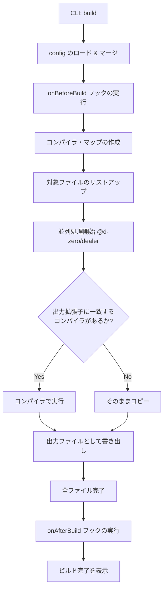
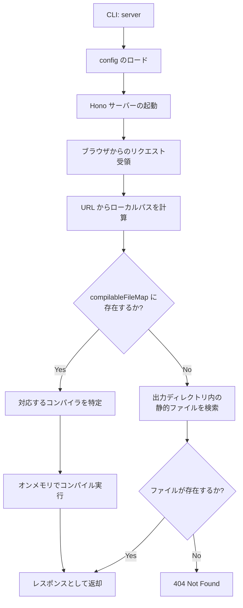

# 🏗️ Kamado 内部アーキテクチャ

Kamado は、「オンデマンドで HTML を焼き上げる」静的サイトジェネレーターです。
このドキュメントでは、Kamado の内部構造、CLI からビルド/サーバー実行までのフロー、およびプラグインシステムについて、主にコントリビューター向けに解説します。

## 核心となるコンセプト

1.  **オンデマンド・コンパイル (Dev Server)**:
    開発サーバーは、リクエストがあった瞬間に必要なファイルだけをコンパイルして返します。これにより、大規模なプロジェクトでも起動が高速です。
2.  **プラグイン・ベースのコンパイラ**:
    HTML、CSS、JavaScript などの各ファイル形式は、それぞれ独立した「コンパイラ」によって処理されます。
3.  **No Runtime**:
    生成される成果物に Kamado 独自のクライアントサイド・ランタイムは含まれません。

---

## ディレクトリ構造

`packages/kamado/src` 配下の主要なディレクトリとその役割です。

- **`index.ts`**: CLI のエントリポイント。`@d-zero/roar` を使用してコマンドを処理します。
- **`builder/`**: 静的ビルド（`kamado build`）の実行ロジック。
- **`server/`**: 開発サーバー（`kamado server`）のロジック。Hono を使用。
- **`compiler/`**: コンパイラ・プラグインのインターフェースと、機能マップの管理。
- **`config/`**: 設定ファイルのロードとマージ、デフォルト値の定義。
- **`data/`**: コンパイル対象ファイルのリストアップ、アセットグループの管理。
- **`files/`**: ファイル読み込み、Frontmatter 処理、キャッシュ管理などのファイル抽象レイヤー。
- **`path/`**: パス解決ユーティリティ。
- **`stdout/`**: コンソール出力のカラーリングやフォーマット。

---

## 実行フロー

### 1. ビルド・フロー (`kamado build`)

全てのファイルを一括でコンパイルし、静的ファイルとして出力するフローです。



### 2. 開発サーバー・フロー (`kamado server`)

ローカル開発時のオンデマンド・コンパイルのフローです。



---

## API と拡張性

### コンパイラ・プラグイン

Kamado の機能拡張は、`CompilerPlugin` を追加することで行います。

```typescript
// Compiler インターフェースの概略
export interface CompileFunction {
	(
		compilableFile: CompilableFile,
		log?: (message: string) => void,
		cache?: boolean,
	): Promise<string | ArrayBuffer> | string | ArrayBuffer;
}
```

コンパイラは `CompilableFile` オブジェクトを受け取り、変換後の内容を返します。この際、ソースコードの読み込みやキャッシュの管理は `CompilableFile` クラス（`src/files/`）が隠蔽します。

### ライフサイクルフック

ユーザーは `kamado.config.ts` を通じてビルドの前後に任意の処理を挿入できます。

- `onBeforeBuild`: ビルド開始前に実行（アセットの事前準備など）。
- `onAfterBuild`: ビルド完了後に実行（サイトマップ生成、通知など）。

---

## 主要な依存ライブラリ

- **[@d-zero/dealer](https://www.npmjs.com/package/@d-zero/dealer)**: 全体の並列処理とプログレス表示を制御。
- **[@d-zero/roar](https://www.npmjs.com/package/@d-zero/roar)**: CLI のコマンド・オプション解析。
- **[Hono](https://hono.dev/)**: 高速な開発サーバーのベース。
- **[cosmiconfig](https://github.com/cosmiconfig/cosmiconfig)**: 設定ファイルの探索。
