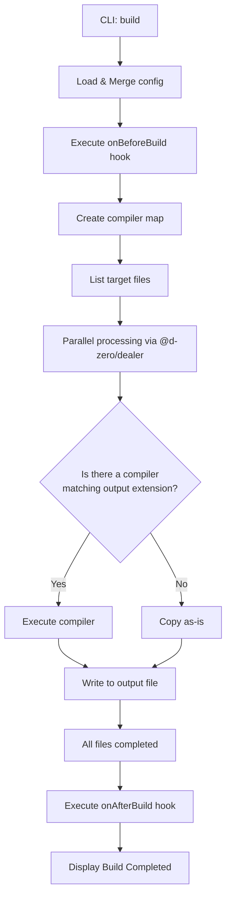
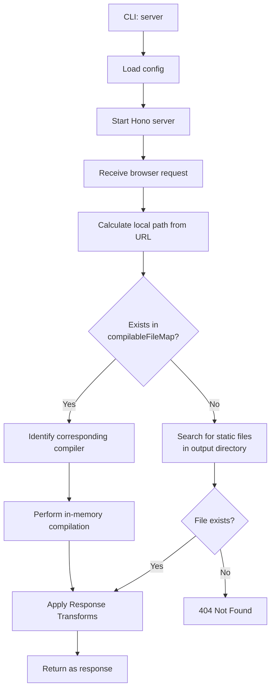

# 🏗️ Kamado Internal Architecture

Kamado is a static site generator that "bakes your HTML hard" on demand.
This document explains Kamado's internal structure, the flow from CLI to build/server execution, and the plugin system, primarily for contributors.

## Core Concepts

1.  **On-demand Compilation (Dev Server)**:
    The development server compiles and serves only the necessary files at the moment a request is made. This ensures fast startup even for large projects.
2.  **Plugin-based Compilers**:
    Each file format (HTML, CSS, JavaScript, etc.) is handled by an independent "compiler" plugin.
3.  **No Runtime**:
    The generated output does not include any proprietary Kamado client-side runtime.
4.  **Config vs Context**:
    Kamado separates user configuration (`Config`) from runtime execution context (`Context`). The `Context` type extends `Config` and adds a `mode` field (`'build' | 'serve'`) that is set by CLI commands at runtime. This allows compilers and hooks to detect whether they are running in build mode or dev server mode.

---

## Config vs Context

### Config

`Config` represents the user-provided configuration from `kamado.config.ts`. It includes:

- Directory settings (`dir.input`, `dir.output`)
- Dev server settings (`devServer.host`, `devServer.port`)
- Package.json information (`pkg.production.baseURL`, etc.)
- Compiler plugins
- Lifecycle hooks

### Context

`Context` extends `Config` and adds runtime execution information:

```typescript
export interface Context extends Config {
	readonly mode: 'serve' | 'build';
}
```

The `mode` field is **not user-configurable**. It is automatically set by the CLI command:

- `kamado build` → `mode: 'build'`
- `kamado server` → `mode: 'serve'`

### Mode Propagation

The execution mode flows through the system as follows:

1. **CLI** (`src/index.ts`): User runs `kamado build` or `kamado server`
2. **Builder/Server** (`src/builder/index.ts` or `src/server/app.ts`): Creates `Context` by spreading `Config` and adding `mode`
3. **Compilers**: Receive `Context` instead of `Config`, allowing them to detect the execution mode
4. **Hooks**: Lifecycle hooks (`onBeforeBuild`, `onAfterBuild`) and compiler hooks (`beforeSerialize`, `afterSerialize`, `replace`) receive the execution mode

This architecture enables mode-specific behavior, such as:

- Using dev server URLs in serve mode vs production URLs in build mode
- Different DOM manipulation behavior in hooks
- Conditional processing based on execution context

---

## Directory Structure

Key directories under `packages/kamado/src` and their roles:

- **`index.ts`**: CLI entry point. Processes commands using `@d-zero/roar`.
- **`builder/`**: Execution logic for static builds (`kamado build`).
- **`server/`**: Logic for the development server (`kamado server`) using Hono.
- **`compiler/`**: Management of compiler plugin interfaces and the function map.
- **`config/`**: Loading and merging configuration files, defining default values.
- **`data/`**: Listing files for compilation and managing asset groups.
- **`files/`**: File abstraction layer for reading files, processing Frontmatter, and managing cache.
- **`path/`**: Path resolution utilities.
- **`stdout/`**: Coloring and formatting for console output.

---

## Execution Flows

### 1. Build Flow (`kamado build`)

The flow for compiling all files at once and exporting them as static files.



### 2. Dev Server Flow (`kamado server`)

The flow for on-demand compilation during local development.



### CompilableFileMap

The `compilableFileMap` is a `Map<string, CompilableFile>` that maps output file paths to their corresponding source files. It is created by:

1. Iterating through all compiler entries in the configuration
2. For each compiler, using `getAssetGroup()` to collect files matching the compiler's `files` pattern (excluding those matching `ignore`)
3. Mapping each file's `outputPath` (the destination path) to the `CompilableFile` object

This map enables the dev server to:

- Quickly look up the source file when a request matches an output path
- Identify which compiler should be used based on the output extension
- Perform on-demand compilation without watching file changes

The map is built once at server startup and used for all subsequent requests.

---

## API and Extensibility

### Compiler Plugins

Kamado's features are extended by adding `CompilerPlugin`s.

```typescript
// Compiler interface receives Context
export interface Compiler {
	(context: Context): Promise<CompileFunction> | CompileFunction;
}

// CompileFunction handles individual file compilation
export interface CompileFunction {
	(
		compilableFile: CompilableFile,
		log?: (message: string) => void,
		cache?: boolean,
	): Promise<string | ArrayBuffer> | string | ArrayBuffer;
}
```

The `Compiler` receives a `Context` object (which includes `mode: 'serve' | 'build'`) and returns a `CompileFunction`. The `CompileFunction` then receives a `CompilableFile` object and returns the transformed content. The `CompilableFile` class (`src/files/`) handles file reading and cache management behind the scenes.

**Note**: Because `Context extends Config`, existing custom compilers that use `Config` as a parameter name will continue to work without changes. However, they can access `context.mode` to detect the execution mode.

### Lifecycle Hooks

Users can insert custom logic before and after the build via `kamado.config.ts`.

- `onBeforeBuild(context: Context)`: Executed before the build starts (e.g., preparing assets). Receives `Context` with `mode` field.
- `onAfterBuild(context: Context)`: Executed after the build completes (e.g., generating sitemaps, notifications). Receives `Context` with `mode` field.

Both hooks receive `Context` instead of `Config`, allowing them to detect whether they are running in build or serve mode.

### Response Transform API

The Response Transform API allows modification of response content during development server mode (`serve` mode only). It is implemented in `src/server/transform.ts` and integrated into the request handling flow in `src/server/route.ts`.

#### Architecture

```typescript
// Transform interface
export interface ResponseTransform {
	readonly name?: string;
	readonly filter?: {
		readonly include?: string | readonly string[];
		readonly exclude?: string | readonly string[];
		readonly contentType?: string | readonly string[];
	};
	readonly transform: (
		content: string | ArrayBuffer,
		context: TransformContext,
	) => Promise<string | ArrayBuffer> | string | ArrayBuffer;
}

// Transform context provides request/response information
export interface TransformContext {
	readonly path: string; // Request path
	readonly contentType: string | undefined; // Response Content-Type
	readonly inputPath?: string; // Source file path (if available)
	readonly outputPath: string; // Output file path
	readonly isServe: boolean; // Always true in dev server
	readonly context: Context; // Full execution context
}
```

#### Execution Flow

1. **Mode Check**: Only executes in `serve` mode (checked in `applyTransforms()`)
2. **Filter Matching**: For each transform, checks:
   - Path patterns using picomatch (glob pattern matching)
   - Content-Type patterns (supports wildcards like `text/*`)
3. **Sequential Execution**: Transforms are applied in array order
4. **Error Handling**: Errors are logged but don't break the server; original content is returned on error

#### Implementation Details

**Location**: `src/server/transform.ts`

Key functions:

- `applyTransforms(content, context, transforms)`: Main execution engine
- `shouldApplyTransform(transform, context)`: Filter matching logic

**Integration**: `src/server/route.ts`

The transform is applied at two points in the request handler:

1. After compiling files matched in `compilableFileMap`
2. After reading static files from the output directory

A helper function `respondWithTransform()` consolidates the transform application logic.

#### Performance Characteristics

- **Minimal Overhead**: Only executes when transforms are configured
- **Streaming-Compatible**: Works with both string and ArrayBuffer content
- **Non-Blocking**: Async transforms are supported via `Promise.resolve()`
- **Fail-Safe**: Individual transform errors don't affect other transforms or the server

#### Use Cases

- **Development Tools**: Inject live reload scripts, debug panels
- **Pseudo-SSI**: Server-side includes for development
- **Header Injection**: Add meta tags, CSP headers (as comments)
- **Source Mapping**: Add source file comments to compiled outputs
- **Mock Data**: Inject test data into API responses

**Note**: This API is intentionally development-only. For production transformations, use compiler hooks (`beforeSerialize`, `afterSerialize`, `replace`) or build-time processing.

---

## Main Dependencies

- **[@d-zero/dealer](https://www.npmjs.com/package/@d-zero/dealer)**: Controls parallel processing and progress display.
- **[@d-zero/roar](https://www.npmjs.com/package/@d-zero/roar)**: CLI command and option parsing.
- **[Hono](https://hono.dev/)**: The foundation for the high-performance dev server.
- **[cosmiconfig](https://github.com/cosmiconfig/cosmiconfig)**: Configuration file discovery.
