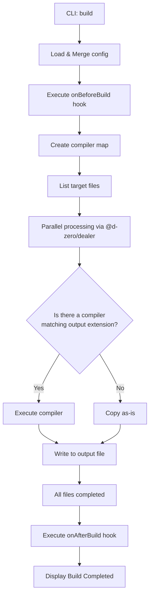
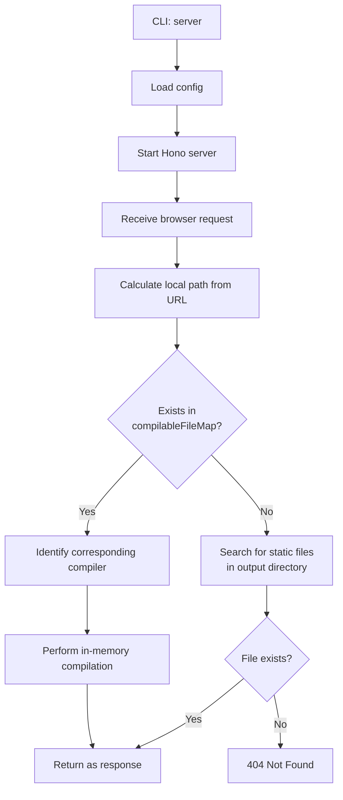

# 🏗️ Kamado Internal Architecture

Kamado is a static site generator that "bakes your HTML hard" on demand.
This document explains Kamado's internal structure, the flow from CLI to build/server execution, and the plugin system, primarily for contributors.

## Core Concepts

1.  **On-demand Compilation (Dev Server)**:
    The development server compiles and serves only the necessary files at the moment a request is made. This ensures fast startup even for large projects.
2.  **Plugin-based Compilers**:
    Each file format (HTML, CSS, JavaScript, etc.) is handled by an independent "compiler" plugin.
3.  **No Runtime**:
    The generated output does not include any proprietary Kamado client-side runtime.

---

## Directory Structure

Key directories under `packages/kamado/src` and their roles:

- **`index.ts`**: CLI entry point. Processes commands using `@d-zero/roar`.
- **`builder/`**: Execution logic for static builds (`kamado build`).
- **`server/`**: Logic for the development server (`kamado server`) using Hono.
- **`compiler/`**: Management of compiler plugin interfaces and the function map.
- **`config/`**: Loading and merging configuration files, defining default values.
- **`data/`**: Listing files for compilation and managing asset groups.
- **`files/`**: File abstraction layer for reading files, processing Frontmatter, and managing cache.
- **`path/`**: Path resolution utilities.
- **`stdout/`**: Coloring and formatting for console output.

---

## Execution Flows

### 1. Build Flow (`kamado build`)

The flow for compiling all files at once and exporting them as static files.



### 2. Dev Server Flow (`kamado server`)

The flow for on-demand compilation during local development.



---

## API and Extensibility

### Compiler Plugins

Kamado's features are extended by adding `CompilerPlugin`s.

```typescript
// Summary of the Compiler interface
export interface CompileFunction {
	(
		compilableFile: CompilableFile,
		log?: (message: string) => void,
		cache?: boolean,
	): Promise<string | ArrayBuffer> | string | ArrayBuffer;
}
```

A compiler receives a `CompilableFile` object and returns the transformed content. The `CompilableFile` class (`src/files/`) handles file reading and cache management behind the scenes.

### Lifecycle Hooks

Users can insert custom logic before and after the build via `kamado.config.ts`.

- `onBeforeBuild`: Executed before the build starts (e.g., preparing assets).
- `onAfterBuild`: Executed after the build completes (e.g., generating sitemaps, notifications).

---

## Main Dependencies

- **[@d-zero/dealer](https://www.npmjs.com/package/@d-zero/dealer)**: Controls parallel processing and progress display.
- **[@d-zero/roar](https://www.npmjs.com/package/@d-zero/roar)**: CLI command and option parsing.
- **[Hono](https://hono.dev/)**: The foundation for the high-performance dev server.
- **[meow](https://github.com/sindresorhus/meow)**: CLI framework.
- **[cosmiconfig](https://github.com/cosmiconfig/cosmiconfig)**: Configuration file discovery.
